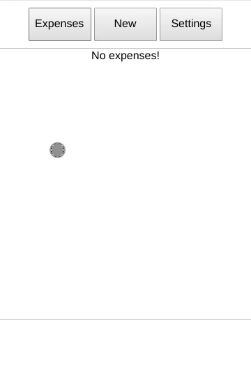

# Budget

#### A smart budgeting app that that predicts the location of the expense being made.

Budget is a JavaScript toy app that implements a [KNN](https://en.wikipedia.org/wiki/K-nearest_neighbors_algorithm) to predict where the expense is being made. 



An online version is hosted [here](https://victorribeiro.com/budget/). You can add it to your phone as an app, if you like.

It uses the day of the week, the hour of the day and the value of the expense as features to predict the location of the purchase. 
Its a toy app because it stores data in the localStorage of the browser. Its not reliable or robust and the code is a bit messy; it was made as an exercise (or proof of concept) after a machine learning class.

The app was written in portuguese, but a quick hack was made to accept other languages. Right now you can choose between english and Brazilian portuguese.

## How to Translate

Make a copy of the en.json file and replace the sentences, translating to the desired language. After that, change the variable `langSetting` in js/main.js to the name of the json file you made:

```javascript
let langSetting = 'js/en.json';
```

[](https://www.paypal.com/cgi-bin/webscr?cmd=_donations&business=victorqribeiro%40gmail%2ecom&lc=BR&item_name=Victor%20Ribeiro&item_number=donation&currency_code=USD&bn=PP%2dDonationsBF%3abtn_donateCC_LG%2egif%3aNonHosted)
